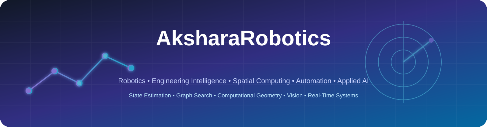
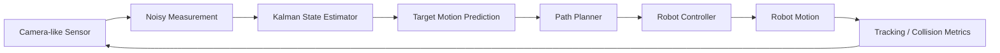
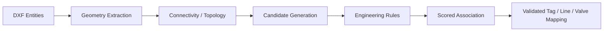
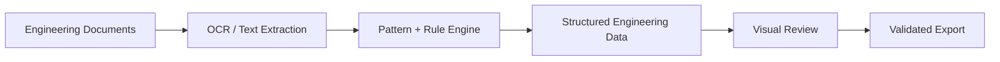
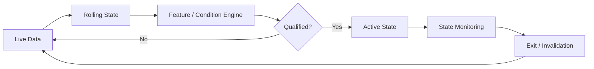
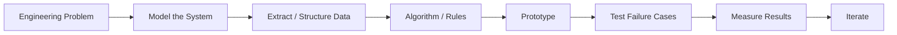

<!--
AksharaRobotics — Technical Portfolio
GitHub profile repository: AksharaRobotics/AksharaRobotics

Recommended structure:
README.md
assets/
  technical-portfolio-banner.svg
-->

<p align="center">
  
</p>

<p align="center">
  <b>Robotics • Engineering Intelligence • Spatial Computing • Automation • Applied AI</b>
</p>

<p align="center">
  
  
  
  
</p>

---

# ⚙️ Technical Portfolio

I build systems that translate **engineering problems and imperfect data into computational models, automation workflows, spatial reasoning, and autonomous decision systems**.

My work spans:

`Robotics` · `State Estimation` · `Path Planning` · `Computer Vision` · `Engineering Geometry` · `Graph Search` · `Document Intelligence` · `3D Spatial Systems` · `Applied AI` · `Workflow Automation` · `Real-Time Decision Engines`

> **Portfolio focus:** technical architecture, algorithms, engineering logic, experimentation, and system design.  
> Professional/client-sensitive implementation details are intentionally generalized.

---

# 🚀 Portfolio at a Glance

<table>
<tr>
<td width="50%" valign="top">

### 🤖 Uncertainty-Aware Target-Following Robot
**Robotics / Autonomous Systems**

Camera-like sensing, noisy observations, Kalman state estimation, target prediction, A*/Dijkstra planning, occlusion, dynamic obstacles, closed-loop control, collision monitoring, and experiment evaluation.

`Kalman Filter` `A*` `Dijkstra` `Control` `Simulation`

**Status:** Public flagship project

[View repository →](https://github.com/AksharaRobotics/uncertainty-aware-target-following-robot)

</td>
<td width="50%" valign="top">

### 🧩 P&ID / DXF Engineering Intelligence
**CAD / Spatial Reasoning**

Associates engineering line numbers, pipe geometry, valves, tags, reducers, and connected segments using geometry, proximity, alignment, topology, engineering rules, and one-to-one assignment logic.

`DXF` `Geometry` `Topology` `Entity Matching` `Spatial Search`

**Status:** Engineering R&D / professional work

</td>
</tr>

<tr>
<td width="50%" valign="top">

### 🏗️ Browser-Based 3D Engineering Router
**3D / Graph Algorithms**

Interactive Three.js engineering environment for instrument-to-JB / routing workflows using graph models, Dijkstra shortest paths, routing constraints, direct object manipulation, copy/move operations, and gizmo-based editing.

`Three.js` `Graph Search` `Dijkstra` `3D Geometry` `JavaScript`

**Status:** Engineering prototype

</td>
<td width="50%" valign="top">

### 📄 Engineering Document Intelligence
**Document Processing / Automation**

Large-scale extraction and engineering-document workflows using Python, OCR/regex, PDF visualization, highlighting, structured outputs, annotation export, bulk processing, and Excel-based results.

`Python` `OCR` `Regex` `PDF` `Flask` `Data Processing`

**Status:** Production / professional systems

</td>
</tr>

<tr>
<td width="50%" valign="top">

### 🧠 Applied AI & Engineering Automation
**AI Workflows / ML / Data**

AI-assisted workflows connecting Python, enterprise data sources, workflow automation, prompt-based processing, structured extraction, clustering, line detection, QR detection, and engineering decision support.

`Python` `AI Workflows` `K-Means` `Computer Vision` `Power Automate`

**Status:** Professional R&D

</td>
<td width="50%" valign="top">

### 🎓 Project Induction / LMS Platform
**Internal Product / Workflow System**

LMS-style induction platform with admin-managed content, user management, certification generation, onboarding automation, and scalable enterprise adoption.

`Power Apps` `Power Automate` `Data` `Workflow Design`

**Status:** Internal product

</td>
</tr>
</table>

---

# 🤖 01 — Uncertainty-Aware Target-Following Robot

<p>
  
  
  
  
</p>

A simulation-based autonomous robot designed to follow a moving target while operating under **sensor noise, incomplete perception, occlusion, static obstacles, and dynamic environmental changes**.

### System Architecture



### Technical Components

- 4-state Kalman model for **position + velocity**
- prediction/correction cycle under noisy measurements
- camera-range and visibility constraints
- temporary detection loss and occlusion scenarios
- target-motion prediction
- A* path planning
- Dijkstra comparison
- static and dynamic obstacles
- closed-loop following behaviour
- collision monitoring
- tracking-error / RMSE evaluation
- scenario-based experiment logging
- failure-mode analysis

### Experimental Focus

```text
Normal sensing
      ↓
High sensor noise
      ↓
Partial / complete occlusion
      ↓
Obstacle interaction
      ↓
Prediction under lost observations
      ↓
Tracking performance comparison
```

The project asks a robotics question rather than only demonstrating an animation:

> **How should an autonomous robot behave when its perception is uncertain, noisy, or temporarily unavailable?**

<p align="center">
  <a href="https://github.com/AksharaRobotics/uncertainty-aware-target-following-robot">
    
  </a>
</p>

---

# 🧩 02 — P&ID / DXF Engineering Intelligence

<p>
  
  
  
</p>

A rule-driven engineering intelligence system for interpreting CAD/DXF drawing geometry and associating engineering information with the correct physical entities.

### Problems Addressed

- joining fragmented but logically continuous line segments
- distinguishing straight continuation from bends and branches
- associating line numbers with the correct pipe run
- preserving text orientation/alignment context
- assigning **one tag to one valve**
- preventing duplicate or distant tag matches
- using pipe size and reducer information to resolve ambiguity
- handling T-junction logic
- differentiating engineering line types/layers
- limiting expensive searches with spatial candidate zones

### Reasoning Pipeline



### Core Technical Ideas

`Computational Geometry` · `Spatial Proximity` · `Text Alignment` · `Graph Connectivity` · `Candidate Ranking` · `Constraint Logic` · `Engineering Topology`

---

# 🏗️ 03 — Browser-Based 3D Engineering Router

<p>
  
  
  
</p>

An interactive browser-based engineering environment exploring **3D routing, spatial manipulation, connectivity, and engineering-object behaviour**.

### Implemented / Explored

- Three.js-based 3D plant-style environment
- engineering components represented as interactive objects
- instrument-to-JB routing
- graph-based routing representation
- Dijkstra shortest-path logic
- route constraints
- component selection and highlighting
- direct move/copy interaction
- transform gizmos
- localized JavaScript dependencies
- interactive engineering properties

### Architecture

```text
Engineering Components
        ↓
3D Spatial Representation
        ↓
Connectivity Graph
        ↓
Routing Constraints
        ↓
Shortest-Path Search
        ↓
Interactive Route / Object Manipulation
```

This work combines **front-end engineering visualization** with **graph algorithms and geometric reasoning** rather than treating 3D only as presentation.

---

# 📄 04 — Engineering Document Intelligence

<p>
  
  
  
</p>

Engineering-document systems developed to transform large unstructured document sets into structured, searchable, reviewable engineering data.

### Technical Capabilities

- bulk PDF processing
- OCR-assisted extraction
- regex / pattern-based engineering tag extraction
- document visualization
- text/location highlighting
- review and annotation workflows
- annotation export
- structured Excel outputs
- Flask / browser-based interfaces
- scalable batch-processing pipelines

### Scale

- **100,000+ engineering tags** processed
- approximately **7,500 documents / 300,000 pages** across major workflows
- batch workflows designed to handle **tens of thousands of documents**

### Technical Pattern



The key challenge is not simply extracting text — it is preserving enough **engineering context and reviewability** to make the result useful.

---

# 🧠 05 — Applied AI / ML Engineering Workflows

<p>
  
  
  
</p>

A collection of engineering R&D work exploring where AI/ML and computer vision can improve engineering workflows.

### Selected Technical Work

**AI-assisted engineering workflow**
```text
Python Processing
      ↓
Enterprise Data / SharePoint
      ↓
Power Automate
      ↓
AI Prompt / Reasoning Step
      ↓
Structured Workflow Output
```

**K-means instrument-to-JB pairing**
- clustering-based grouping
- engineering proximity / assignment problem
- automated candidate pairing

**Vision / extraction experiments**
- QR detection
- line detection
- OCR
- structured information extraction
- engineering-image/document interpretation

**Engineering data automation**
- rule-based transformations
- dashboard pipelines
- structured output generation
- human-in-the-loop validation

---

# 📐 06 — CAD & Spatial Automation

Engineering automation work involving CAD objects, coordinates, engineering metadata, and spatial placement logic.

### Examples

- AutoCAD block-placement automation
- MS Access ↔ CAD data integration
- rule-based spatial placement
- engineering tag / object association
- coordinate-driven automation
- drawing-data extraction and transformation

### Core Pattern

```text
Engineering Data
      +
Spatial Rules
      +
CAD Geometry
      ↓
Automated Placement / Association
```

This is one of the recurring themes across my work: converting **engineering intent into geometric and computational rules**.

---

# 🗺️ 07 — Autonomous Navigation & Path-Planning Experiments

Separate navigation experiments have explored the fundamentals behind autonomous movement and routing:

- grid / graph world representation
- traversable vs blocked regions
- A* search
- Dijkstra shortest paths
- target-directed navigation
- obstacle-aware route generation
- path-cost comparison

These experiments feed directly into the navigation layer of the flagship robotics project.

---

# 🎓 08 — Project Induction / LMS Platform

A productized internal digital platform for scalable project onboarding and learning workflows.

### System Features

- admin-managed learning content
- user management
- structured induction flow
- certification generation
- automated onboarding
- scalable enterprise usage

### Impact

- onboarding automation saving approximately **45 minutes per user**
- adopted by **1,000+ employees**

This project strengthened my experience in taking an internal idea from **workflow problem → product structure → automation → adoption**.

---

# 📊 09 — Data & Dashboard Systems

Engineering and organizational data solutions built around repeatable data pipelines and decision-support dashboards.

### Experience

- Power BI dashboards
- data transformation
- workflow automation
- enterprise reporting
- project-level tracking
- structured engineering outputs

Selected dashboards have supported **25+ projects** and tracking/reporting workflows covering **7,000+ employees**.

---

# ⚡ 10 — Real-Time Decision Engine — Personal R&D

A personal real-time systems project exploring how streaming data, multiple indicators, state transitions, and historical replay can be combined into a deterministic decision engine.

### Technical Areas

- live data polling
- rolling time-window state
- event / signal qualification
- multi-condition gating
- finite-state-style trade lifecycle
- risk / exit-state logic
- CSV replay and backtesting
- candidate → confirmation → active → exit transitions
- diagnostic logging and pass/fail reasons

### Engineering Value

The interesting part of this project is the **real-time decision architecture**:



This project is intentionally secondary to the robotics and engineering-intelligence portfolio, but demonstrates experience with **streaming state, deterministic rules, and replay-based validation**.

---

# 🔬 Technical Themes Across My Projects

| Technical Theme | Where I Apply It |
|---|---|
| **State Estimation** | Kalman-based robot tracking |
| **Graph Search** | A*, Dijkstra, autonomous navigation, 3D routing |
| **Computational Geometry** | DXF/P&ID analysis, CAD automation, 3D routing |
| **Spatial Reasoning** | tag association, line topology, component routing |
| **Computer Vision** | camera-like sensing, QR/line detection, OCR experiments |
| **Document Intelligence** | engineering tag extraction, PDF processing, review workflows |
| **Optimization / Clustering** | K-means instrument-to-JB pairing |
| **Control / Feedback** | autonomous target following |
| **Real-Time State Machines** | live decision engine |
| **Human-in-the-Loop Systems** | engineering validation and annotation workflows |
| **Enterprise Automation** | Power Platform, Python, LMS, data workflows |
| **Experimental Evaluation** | robotics scenarios, replay/backtesting, feasibility studies |

---

# 🧰 Technology Stack

### Core Development

<p>
  
  
  
  
  
</p>

### Algorithms / Robotics / Vision

<p>
  
  
  
  
  
</p>

### Engineering / Spatial

<p>
  
  
  
  
</p>

### Data / Automation

<p>
  
  
  
  
</p>

---

# 🧠 How I Approach Technical Problems



I am most interested in systems where **software has to understand or act on physical-engineering structure** — geometry, motion, connectivity, uncertainty, constraints, or human workflow.

---

# 📌 Public Work

### 🤖 [Uncertainty-Aware Target-Following Robot](https://github.com/AksharaRobotics/uncertainty-aware-target-following-robot)

`Robotics` `Kalman Filter` `State Estimation` `A*` `Dijkstra` `Occlusion` `Dynamic Obstacles` `Control` `Experimental Evaluation`

> Additional professional projects are described at architecture/concept level because their source code and engineering data are proprietary.

---

<p align="center">
  <b>Engineering problems → computational models → intelligent systems.</b>
</p>

<p align="center">
  
  
  
  
</p>
